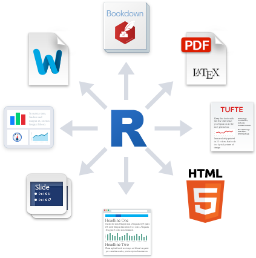
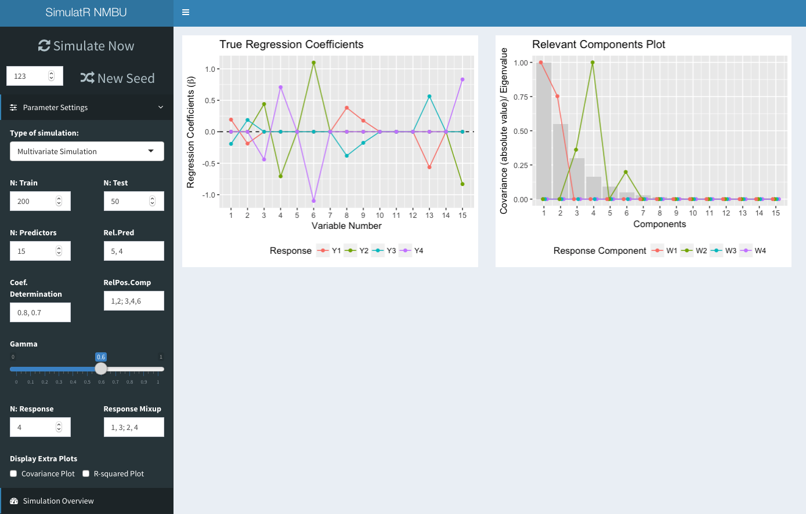
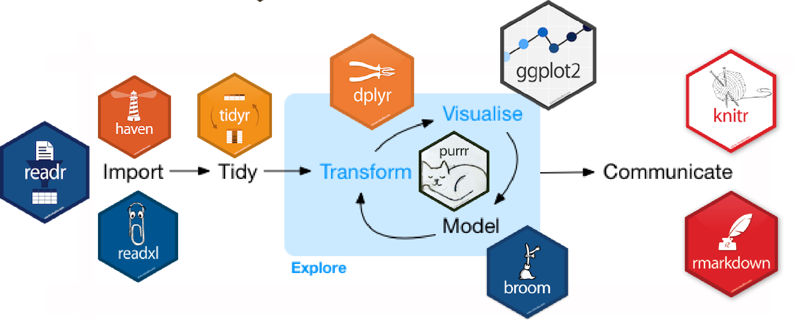

class: middle, center

.flex-container[
  .half[
    # How one can sing a song exactly same after many years
  ].half[
    
  ]
]

---

class: middle, center

.flex-container[
  .half[
    
  ].half[
    # They have documented all the details of the song
  ]
]

---

class: inverse, middle, center

.huge[
# Can you reproduce your research after five years from now?
]

---

class: middle, center


# Steps to follow for reproducible Research

.process-steps[
## Make data and code availiable
## Make documentation
## So, other people reproduce your work
]

---

class: inverse, middle, center

.huge[
# SAME DATA + SAME CODE 
# = 
# SAME OUTPUT
]

---

class: middle, center

# Approaches and tools for R programming

.flex-container[
.half[

].half[

].half[

]
].flex-container[
.half[

].half[

]
]

---
class: inverse, middle, center

# Dynamic Document

---
class: middle

.left-column[
## Literate Programming
### Knitr, Rmarkdown
.flex-container[
  .half[
    
  ].half[
    
  ]
]
].right-column[
```{r, echo = FALSE, out.width = "50%"}

```

## Some Extensions
.flex-container[
.half-top[
### Presentations .small[([revealjs](https://mathatistics.github.io/nsm-17/#/title), [remarkjs](https://therimalaya.github.io/stat210-repetition/Day1#1))]
].half-top[
### Articles .small[([rticles](https://github.com/rstudio/rticles))]
].half-top[
### Books .small[([bookdown](http://stat210.netlify.com))]
].half-top[
### Websites .small[([blogdown](http://mathatistics.com))]
]
]
]

---
class: middle

.left-column[
## Shiny
.flex-container[

]
].right-column[

.flex-container[
.left[
> ### Dynamic Application

> ### Dashboard
]
]
]

---
class: inverse, middle, center

# Version Control

---
class: middle

.left-column[
## Git
### Github
### Bitbucket

.flex-container[
.half[

].half[

]
]
].right-column[
```{r, echo = FALSE, out.width = "75%"}
knitr::include_graphics("https://www.git-tower.com/learn/content/01-git/01-ebook/en/01-command-line/04-remote-repositories/01-introduction/basic-remote-workflow.png")
```

.code[.right[.small[source: https://www.git-tower.com]]]

.left[
.tidy[
- Solution to mess of copies of same document
- Working in a team (collaboration)
- Better organization
]
]
]

---

# Workflow



.tidy[
- Version control comes in every steps
- Document and track all the steps you follow
- Pipeline the workflow from raw data to final product
]

---

class: inverse, middle, center

.huge[
# Thank You
]